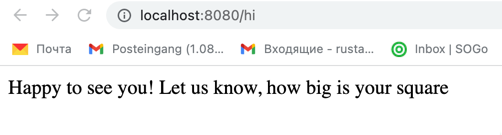
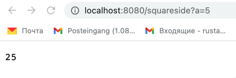

**Project Quadrat Calculation**

The Project has 2 methods
* salute()

      if user send hi, he/she is getting a greeting 
      and a question about her/his square value

* calculateArea()

      if user provide a value of side of the square, 
      he/she gets an area value of it

*The project is available to download at the repository*
https://github.com/Rustam-A-A/QuadratCalc

